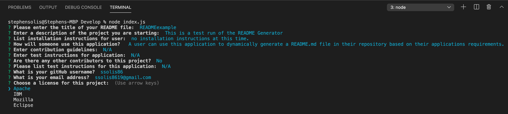
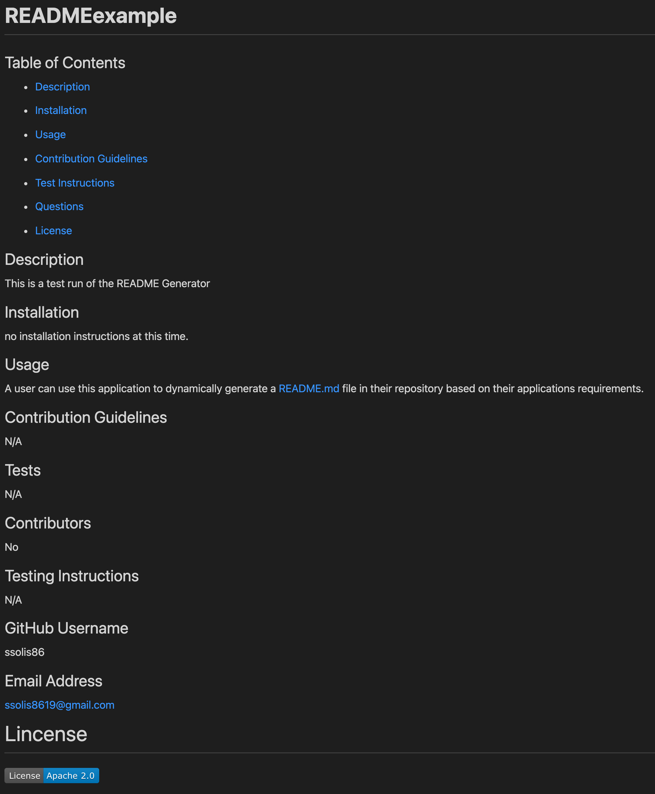

# **README Generator**
    
## Table of Contents
    
 *  [Description](#description)
    
 *  [Usage](#usage)
    
 *  [Tests](#Tests)

 *  [Contributors](#contributors)

 *  [Images](#Images)
    
 *  [Contact](#Contact)
    

## Description
    
This README Generator allows the user to dynamically enter "Installation instructions, Usage Information, Contribution Guidelines, Test Instructions, Questions and an applicable license" to be generated in their readme file.      
    
## Usage
    
 The use of this application will allow the user to generate a readme file through inputs within a terminal.
    
## Tests
    
The latest test to debug and ensure optimization was performed on 3-13-21 
    
## Contributors
    
Stephen Solis

## Images

### User responses to generate readme.md

#### Example of generated REAME.md in Preview mode.

## Contact

### GitHub Username
https://github.com/ssolis86
    
### Email Address
ssolis8619@gmail.com